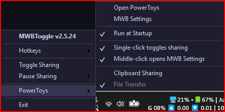

# MWBToggle

Toggle **Mouse Without Borders** clipboard and file sharing on/off with a hotkey or tray icon click.

## What It Does

Toggles the `ShareClipboard` and `TransferFile` settings in PowerToys Mouse Without Borders. Useful when you want to quickly disable clipboard sharing for privacy (passwords, sensitive data) without opening PowerToys settings.

- **Hotkey**: `Ctrl + Alt + C` (configurable in `MWBToggle.ini`)
- **Tray icon**: Green = sharing ON, Red = sharing OFF
- **Left-click** tray icon to toggle
- **Right-click** tray icon for menu

## Screenshots

| Sharing ON | Sharing OFF | Tray Menu |
|:---:|:---:|:---:|
|  |  |  |

## What It Looks Like

**Tray Icon:** A small colored icon sits in your Windows system tray (bottom-right). Green when clipboard/file sharing is ON, red when OFF. Left-click to toggle, right-click for the menu.

**Tray Menu (right-click):**
- Toggle Sharing (on/off)
- Pause Sharing (5 / 15 / 30 minutes with checkmark, then auto-resumes)
- Open PowerToys Settings
- Run at Startup (creates/removes a startup shortcut)
- About (shows version, hotkey, GitHub link)
- Exit

**On-Screen Display:** When you toggle, a brief tooltip appears near your cursor showing the new state (e.g., "Sharing ON" or "Sharing OFF"). Appears on whichever monitor you're working on.

**Settings file:** Optional `MWBToggle.ini` in the same folder as the script. Configures hotkey, confirmation prompt, and sound feedback.

## Requirements

- Windows 10/11
- [PowerToys](https://github.com/microsoft/PowerToys) with Mouse Without Borders enabled

**For the C# version (recommended):**
- [.NET 8 Runtime](https://dotnet.microsoft.com/download/dotnet/8.0) (or publish self-contained — see below)

**For the AHK version (legacy):**
- [AutoHotkey v2](https://www.autohotkey.com/)

## Installation

### Option A: C# version (recommended)

The C# port in `MWBToggle.CSharp/` is a native Windows tray app — no AHK runtime, lower resource usage, no mouse jump issues.

**Run directly:**
```
cd MWBToggle.CSharp
dotnet run
```

**Build an .exe:**
```
cd MWBToggle.CSharp
dotnet publish -c Release
```
The output exe will be in `bin/Release/net8.0-windows/win-x64/publish/`.

**Build a self-contained .exe (no .NET runtime required on target machine):**
```
cd MWBToggle.CSharp
dotnet publish -c Release --self-contained true
```

Place your `MWBToggle.ini` in the same folder as the .exe if you want custom settings.

### Option B: AHK version (legacy)

1. Install [AutoHotkey v2](https://www.autohotkey.com/)
2. Clone or download this repo
3. Double-click `MWBToggle.ahk` to run

## Customization

Create a `MWBToggle.ini` file in the same folder as the exe to override defaults:

```ini
[Settings]
Hotkey=^!c
ConfirmToggle=false
SoundFeedback=false
MiddleClickMwbSettings=true
```

| Key | Default | Description |
|-----|---------|-------------|
| `Hotkey` | `^!c` | Hotkey string (`#` Win, `^` Ctrl, `!` Alt, `+` Shift) |
| `ConfirmToggle` | `false` | Prompt before each toggle |
| `SoundFeedback` | `false` | Beep on toggle (high tone ON, low tone OFF) |
| `MiddleClickMwbSettings` | `true` | Middle-click tray icon opens MWB settings |

If no INI file exists, the app uses the defaults above.

## Troubleshooting

**"Mouse Without Borders doesn't appear to be running"**
- Make sure PowerToys is running and Mouse Without Borders is enabled in PowerToys settings.

**"Settings file not found"**
- Mouse Without Borders must be run at least once to create its settings file.
- Default path: `%LOCALAPPDATA%\Microsoft\PowerToys\MouseWithoutBorders\settings.json`

**"Could not write to settings.json"**
- The file may be locked by MWB. Wait a moment and try again.
- If persistent, close PowerToys, toggle, then reopen PowerToys.

**Tray icon doesn't update**
- The C# version uses a file watcher and updates instantly when settings change. If it seems stuck, left-click the tray icon to force a toggle and re-sync.

## Files

| File | Purpose |
|------|---------|
| `MWBToggle.CSharp/` | C# port (recommended) — .NET 8 Windows Forms tray app |
| `MWBToggle.ahk` | Legacy AHK v2 script |
| `on.ico` | Tray icon — sharing ON (green) |
| `mwb.ico` | Tray icon — sharing OFF (red) |
